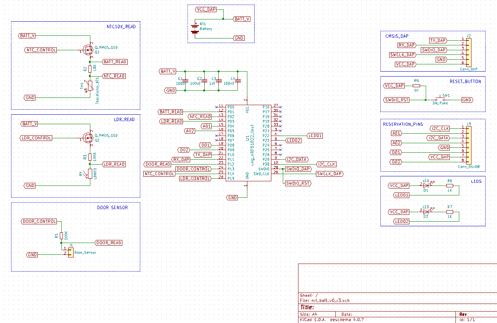
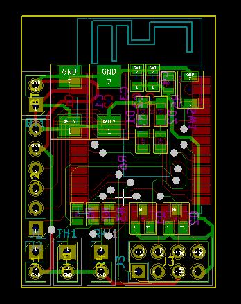
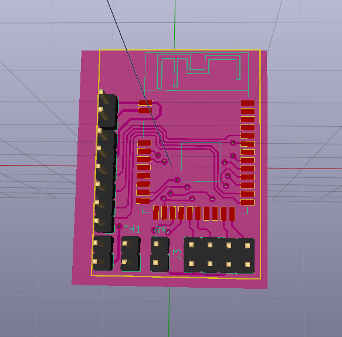
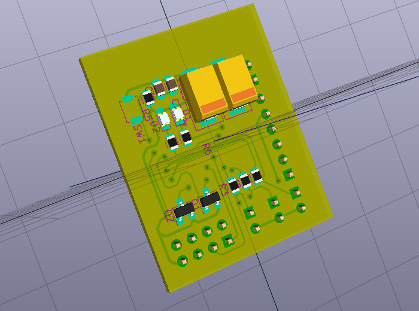

# knot_ble_kicad
Schematic and PCB design for BLE - Knot

## Version 0, Revion 3:
  (SCHEMATIC) https://github.com/myDoorKeeper/knot_ble_kicad/blob/master/out/nrf_batt_v0_r3.pdf
    
   
    
    
   
